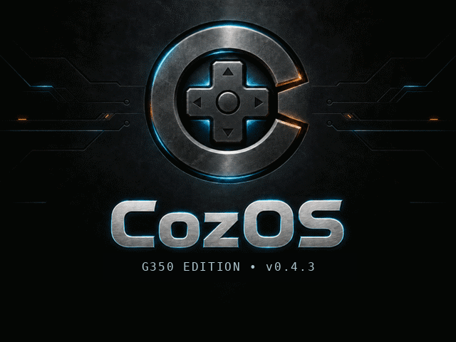

# CozOS G350



**CozOS is a tested BATLEXP G350 enhancement pack for official KNULLI.**

It is not currently a complete replacement firmware image. Install the official
KNULLI G350 image first, then copy the CozOS update to the `SHARE` partition and
run it from Ports. This approach is faster to test, easier to roll back, and
keeps KNULLI as the maintained Linux/emulator base.

## Download

### CozOS G350 0.6.0

The release contains two packages:

- `CozOS-G350-Overlay-0.6.0.zip` — full first-install/repair package.
- `CozOS-G350-Update-0.6.0.zip` — versioned Control Center update package.

Verify downloads against the adjacent `.sha256` files in `releases/`.

The hardware baseline is a BATLEXP G350 with **KNULLI Scarab 2026-05-10**.

## What CozOS adds

- Working `FN + Volume Up/Down` brightness controls.
- Safe short-power-button screen-off/wake behavior for the G350 build where
  normal suspend shut the device down instead of resuming.
- Hold Power for about two seconds for a normal shutdown.
- Automatic extended idle mode uses shutdown instead of broken suspend.
- G350-oriented emulator/core defaults and performance profiles.
- Conservative scaling, latency, audio, and frame-pacing defaults.
- A working CozOS boot splash using KNULLI's rootfs overlay mechanism.
- Preservation of ROMs, BIOS files, saves, save states, scraped media, and
  existing explicit emulator settings.
- Checksum-verified settings backups and complete CozOS removal/rollback.
- One permanent **CozOS Control Center** for install/repair, diagnostics,
  backups, verified restore, updates, version rollback, and removal.
- Versioned Control Center applications under `/userdata/system/cozos/apps`, so
  an update is staged and verified before the active version is switched.
- Local updates from `SHARE/cozos-updates` and optional checksum-verified online
  updates, with progress, persistent logs, and a restart notice.

## First install / upgrade to 0.6.0

1. Install and boot the official KNULLI G350 image at least once.
2. Extract `CozOS-G350-Overlay-0.6.0.zip` on a computer. Do not flash the ZIP.
3. Copy the **contents** of its `roms/ports` folder into the existing
   `roms/ports` folder on KNULLI's `SHARE` partition.
4. Allow the `cozos` folder and files to merge/replace older versions.
5. Boot the G350 and open **Ports → CozOS Control Center**.
6. On its first 0.6.0 launch, the stable Ports entry bootstraps the application
   into `/userdata/system/cozos/apps/0.6.0` and records it as the active version.
7. Choose **Install or repair CozOS 0.6.0** and let the overlay save finish.
8. Reboot normally through KNULLI.

You do not need to uninstall an older CozOS version before upgrading.

## Future CozOS updates

For an offline update, copy `CozOS-G350-Update-x.y.z.zip` to:

```text
SHARE/cozos-updates
```

Then open **CozOS Control Center → Install local update**. The updater validates
the package manifest and SHA-256 hashes, stages the new version separately, and
changes the active-version pointer only after validation succeeds. The previous
version is retained for Control Center rollback.

When network access is available, **Check and install online update** uses the
published release index and verifies the package SHA-256 before installation.
Update activity is logged at:

```text
/userdata/system/cozos/logs/updates.log
```

See [the full installation and recovery guide](docs/INSTALL.md).

## Project direction

The supported path is now:

```text
Official KNULLI G350 image + CozOS G350 update pack
```

We are not spending normal development time rebuilding the entire KNULLI image
for every CozOS change. A full image may return later if CozOS needs kernel,
device-tree, bootloader, or driver changes that cannot be delivered safely as
an overlay. The inherited KNULLI/Buildroot source remains in this fork for that
future work and for upstreamable patches.

## Known limitation

The G350 rumble motor activates briefly during early boot. That occurs before
the current CozOS user-space overlay loads, so 0.6.0 does not change it.

## Source layout

- `overlay/g350/` — installable full overlay source.
- `releases/` — downloadable full/update packages, checksums, and release index.
- `docs/` — installation, recovery, compatibility, and feature notes.
- `tools/build_overlay_release.py` — deterministic full-overlay and versioned
  updater packaging/validation; it does not compile a firmware image.
- inherited KNULLI folders — upstream Buildroot/firmware source retained for
  low-level development.

## Upstream and license

CozOS is based on and intended to complement
[KNULLI](https://github.com/knulli-cfw/knulli-linux). Individual components
retain their upstream licenses. See `COPYING` and `overlay/g350/LICENSE.txt`.

This is a community project and is not an official KNULLI release.
